# DORI Application Flow - Mermaid Diagrams

## 1. Overall Application Flow


## 2. Face Recognition Pipeline


## 3. Enrollment Flow


## 4. Summarization Flow

```mermaid
flowchart TB
    subgraph CAPTURE["📝 Interaction Capture"]
        A[Face Recognized] --> B[Start Recording]
        B --> C[Speech-to-Text]
        C --> D[Store Transcription]
        D --> E[Face Leaves Frame]
        E --> F[Stop Recording]
    end

    subgraph STORAGE["💾 Data Storage"]
        F --> G[Create Activity Log]
        G --> H[Save to Firestore]
        H --> I[Link to Patient & Person]
    end

    subgraph SUMMARIZATION["🤖 AI Summary"]
        I --> J{Generate Summary?}
        J -->|Interaction End| K[Single Interaction Summary]
        J -->|Daily Recap| L[Day-by-Day Summary]
        
        K --> M[Build Prompt with Context]
        L --> N[Aggregate Day's Activities]
        
        M --> O[Call Gemini API]
        N --> O
        
        O --> P[Receive AI Response]
        P --> Q[Store Summary]
    end

    subgraph DISPLAY["📱 User Display"]
        Q --> R[AR Overlay Info]
        Q --> S[Daily Recap Screen]
        R --> T[Show Recent Summary]
        S --> U[Show Day Stories]
    end

    style CAPTURE fill:#e8f5e9
    style STORAGE fill:#fff3e0
    style SUMMARIZATION fill:#e3f2fd
    style DISPLAY fill:#fce4ec
```



## 5. State Management Flow


## 6. Data Flow Architecture

```mermaid
flowchart LR
    subgraph CLIENT["📱 Flutter App"]
        A[UI Layer] --> B[State Management]
        B --> C[Service Layer]
    end

    subgraph LOCAL["💾 On-Device"]
        C --> D[TFLite Model]
        C --> E[ML Kit]
        C --> F[Speech Recognition]
    end

    subgraph CLOUD["☁️ Firebase"]
        C --> G[Authentication]
        C --> H[Cloud Firestore]
        C --> I[Firebase Storage]
    end

    subgraph AI["🤖 Google AI"]
        C --> J[Gemini API]
    end

    H --> K[(Users Collection)]
    H --> L[(Known Faces)]
    H --> M[(Activity Logs)]
    I --> N[(Face Images)]

    style CLIENT fill:#e8f5e9
    style LOCAL fill:#fff3e0
    style CLOUD fill:#e3f2fd
    style AI fill:#fce4ec
```



---

## How to Use These Diagrams

1. **Copy the Mermaid code** between the ```mermaid``` blocks
2. **Paste into any Mermaid-compatible tool:**
   - [Mermaid Live Editor](https://mermaid.live/)
   - GitHub Markdown (renders automatically)
   - VS Code with Mermaid extension
   - Notion, Confluence, etc.
3. **Export as SVG or PNG** for presentations

## Quick Mermaid Live Editor Links

For quick rendering, paste this URL format in your browser:
```
https://mermaid.live/edit
```

Then paste the diagram code to see it rendered!
