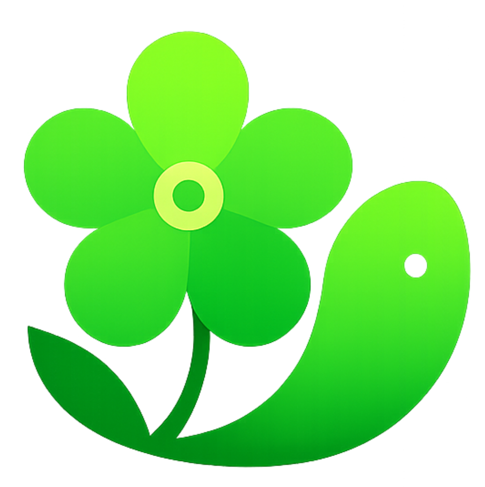

# 🐠 Dori - AR Memory Assistant for Dementia Care

<p align="center">
  
</p>

<p align="center">
  <strong>An AI-powered augmented reality application helping dementia patients recognize faces and remember daily interactions.</strong>
</p>

<p align="center">
  <a href="#features">Features</a> •
  <a href="#tech-stack">Tech Stack</a> •
  <a href="#getting-started">Getting Started</a> •
  <a href="#architecture">Architecture</a> •
  <a href="#screenshots">Screenshots</a>
</p>

---

## 🎯 Overview

**Dori** (named after the lovable forgetful fish from "Finding Nemo") is a **Flutter-based mobile application** designed to assist individuals with dementia or memory impairments. By leveraging **real-time face recognition**, **augmented reality overlays**, and **AI-powered conversation summarization**, Dori helps patients recognize familiar faces and maintain meaningful connections with their loved ones.

## ✨ Features

### 👤 For Patients

| Feature | Description |
|---------|-------------|
| **🎯 Real-Time Face Recognition** | Instantly identifies known faces using TensorFlow Lite and ML Kit |
| **🏷️ AR Name Overlays** | Displays the person's name, relationship, and recent interaction summaries as floating AR bubbles |
| **🎤 Voice Transcription** | Automatically transcribes conversations in real-time using speech-to-text |
| **📝 AI Summaries** | Generates warm, personalized summaries of interactions using Google Gemini AI |
| **📅 Daily Recaps** | Beautiful day-by-day summaries of who the patient met and what they discussed |
| **🔊 Text-to-Speech** | Reads out summaries and information aloud for accessibility |

### 👨‍⚕️ For Caregivers

| Feature | Description |
|---------|-------------|
| **📊 Dashboard** | Overview of total interactions, patients, known faces, and activity |
| **👥 Patient Management** | Add and manage multiple patients with QR code linking |
| **📸 Face Enrollment** | Easily add known faces with multi-angle capture for better recognition |
| **📜 Activity History** | View detailed logs of patient interactions with transcripts |
| **⏰ Scheduled Summaries** | Automatic daily notifications with patient activity summaries |

### 🎨 UI/UX Highlights

- **Glassmorphism Design** - Modern frosted glass aesthetic throughout the app
- **Jade Green Theme** - Calming, accessible color palette
- **Responsive Layouts** - Optimized for both portrait and landscape orientations
- **Animated Transitions** - Smooth, elegant animations and micro-interactions
- **Floating AR Bubbles** - Non-intrusive overlays that don't obscure faces

## 🛠️ Tech Stack

### Frontend
- **Flutter** - Cross-platform UI framework
- **Provider** - State management
- **Material Design 3** - UI components

### AI & Machine Learning
- **TensorFlow Lite** - On-device face embedding extraction (MobileFaceNet)
- **Google ML Kit** - Real-time face detection
- **Google Gemini AI** - Conversation summarization and narrative generation

### Backend & Storage
- **Firebase Authentication** - User authentication with role-based access
- **Cloud Firestore** - Real-time database for users, faces, and activity logs
- **Firebase Storage** - Face image storage

### Additional Packages
- **Camera** - Real-time camera streaming
- **Speech to Text** - Voice transcription
- **Flutter TTS** - Text-to-speech output
- **QR Code Scanner** - Patient-caregiver linking

## 🚀 Getting Started

### Prerequisites

- Flutter SDK ^3.10.1
- Dart SDK ^3.10.1
- Android Studio / VS Code
- Firebase account
- Google Gemini API key

### Installation

1. **Clone the repository**
   ```bash
   git clone https://github.com/your-username/dori.git
   cd dori
   ```

2. **Install dependencies**
   ```bash
   flutter pub get
   ```

3. **Configure Firebase**
   - Create a new Firebase project
   - Enable Authentication (Email/Password)
   - Create a Firestore database
   - Create a Storage bucket
   - Download and add `google-services.json` (Android) and `GoogleService-Info.plist` (iOS)

4. **Set up environment variables**
   
   Create a `.env` file in the root directory:
   ```env
   GEMINI_API_KEY=your_gemini_api_key_here
   ```

5. **Add TensorFlow Lite model**
   
   Place the MobileFaceNet model in:
   ```
   assets/models/mobile_face_net.tflite
   ```

6. **Run the app**
   ```bash
   flutter run
   ```

## 📁 Architecture

```
lib/
├── main.dart                 # App entry point
├── firebase_options.dart     # Firebase configuration
│
├── models/
│   ├── user_model.dart       # User data model (caregiver/patient)
│   ├── known_face_model.dart # Known face with embeddings
│   └── activity_log_model.dart # Interaction logs
│
├── providers/
│   └── user_provider.dart    # Authentication state management
│
├── screens/
│   ├── splash_screen.dart    # Animated splash with glassmorphism
│   ├── auth/
│   │   ├── login_screen.dart
│   │   └── register_screen.dart
│   ├── patient/
│   │   ├── patient_home_screen.dart
│   │   ├── face_recognition_screen.dart  # Main AR camera view
│   │   └── daily_recap_screen.dart
│   └── caregiver/
│       ├── caregiver_dashboard.dart
│       ├── patient_management_screen.dart
│       ├── manage_known_faces_screen.dart
│       ├── add_known_face_screen.dart
│       ├── live_face_enrollment_screen.dart
│       └── activity_history_screen.dart
│
├── services/
│   ├── auth_service.dart           # Firebase Authentication
│   ├── database_service.dart       # Firestore operations
│   ├── face_recognition_service.dart # TFLite + ML Kit
│   ├── speech_service.dart         # Speech-to-text
│   ├── summarization_service.dart  # Gemini AI integration
│   └── scheduled_summary_service.dart
│
├── widgets/
│   ├── ar_overlay_widget.dart      # Floating AR name bubbles
│   ├── enrollment_bubble_widget.dart
│   ├── enrollment_prompt_widget.dart
│   └── day_by_day_summary_widget.dart
│
└── utils/
    ├── constants.dart              # Colors, strings, thresholds
    └── helpers.dart                # Utility functions
```

## 📱 User Flows

### Patient Flow
```
Login → Patient Home → Start Remembering → Face Recognition Screen
                                              ↓
                                    See AR overlays with names
                                    Conversations auto-transcribed
                                              ↓
                                    View Daily Recap → AI-generated summaries
```

### Caregiver Flow
```
Login → Dashboard → Manage Patients → Add/Link Patient via QR
                  → Manage Known Faces → Add faces with multi-angle capture
                  → View Activity History → See interaction logs
```

## 🔧 Configuration

### Face Recognition Thresholds
Adjust in `lib/utils/constants.dart`:
```dart
static const double faceRecognitionThreshold = 0.75;
static const double faceDetectionConfidence = 0.2;
static const int maxFacesPerFrame = 5;
```

### Gemini AI Model
The app uses `gemini-2.5-flash` for summarization. Configure in `constants.dart`:
```dart
static const String geminiApiUrl = 
    'https://generativelanguage.googleapis.com/v1beta/models/gemini-2.5-flash:generateContent';
```

## 🤝 Contributing

Contributions are welcome! Please feel free to submit a Pull Request.

1. Fork the repository
2. Create your feature branch (`git checkout -b feature/AmazingFeature`)
3. Commit your changes (`git commit -m 'Add some AmazingFeature'`)
4. Push to the branch (`git push origin feature/AmazingFeature`)
5. Open a Pull Request

## 📄 License

This project is licensed under the MIT License - see the [LICENSE](LICENSE) file for details.

## 🙏 Acknowledgments

- **Finding Nemo** - Inspiration for the name "Dori" 🐠
- **TensorFlow Lite** - On-device ML capabilities
- **Google ML Kit** - Face detection
- **Google Gemini** - AI-powered summarization
- **Firebase** - Backend infrastructure

## 👥 Team

Built with ❤️ by **The Great Dane-ger** team for Google Developer Groups (GDG)

---

<p align="center">
  <em>"Just keep swimming, just keep swimming..." 🐠</em>
</p>
